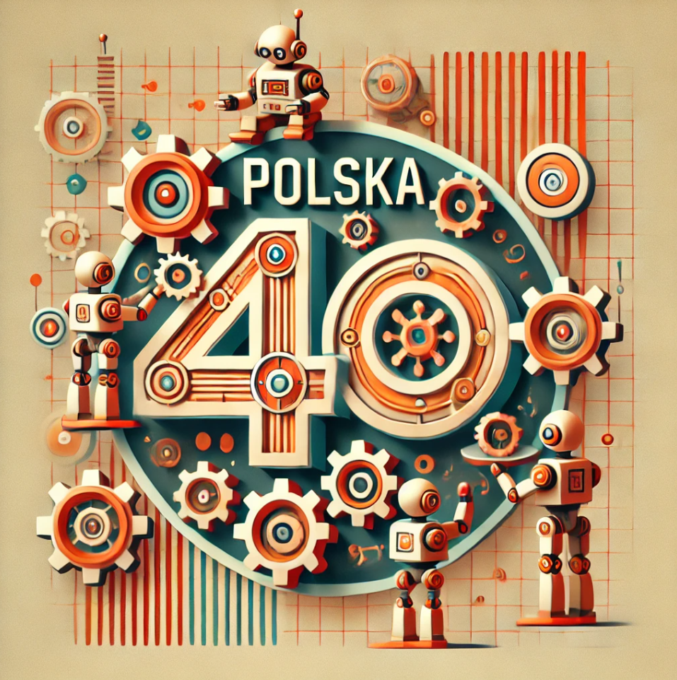

# Polska 4.0

## Polska Będzie Programowalna

Rozwój współczesnego świata zmierza w kierunku coraz większej roli technologii w szczególnosci stucznej inteligencji i robotyki, 
co stawia przed nami wyzwanie, jaką rolę mamy mieć my i nasz kraj w tym nowym, wspaniałym świecie. Jest oczywiste, że nie zatrzymamy 
postępu, więc musimy aktywnie działać i wpływać na to, jak ten postęp postępuje, czyli programować go.

## Ryzko nic nie robienia jest większe niż ryzyko robienia czegokolwiek

Strategia strusia, czyli chowania głowy w piasek i ignorowania wyzwań, nie prowadzi do niczego. 
Jedynie działanie pozwala na osiągnięcie sukcesu, i to jest naszym celem w projekcie Polska 4.0.

## Nie jesteś jeszcze w projekcie? To zgłoś się!

Tylko aktywni i myślący mają wpływ na przyszłość. Aby w pełni wykorzystać szanse, jakie daje rozwój technologii, 
musimy działać w celu uaktywnienia jak największej liczby osób i oddolnych incjatwy. 

Klinknij ten link żeby dołaczyć do nas na serweże [Discord](https://discord.gg/t3FhBJYFmd)

## Aktywne pod-projekty

[Analiza Strategii Cyfryzacji do 2035](https://github.com/orgs/Polska-4-0/projects/2)

Tekst opracowano z użyciem polskiego wielkiego modelu językowego [Bielik](https://bielik.ai/) 

